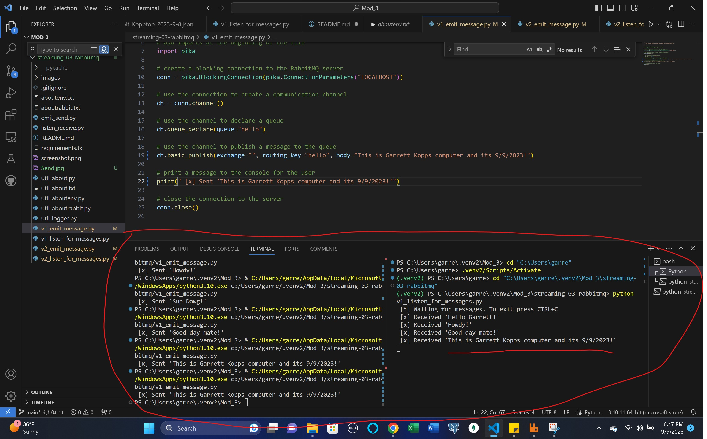
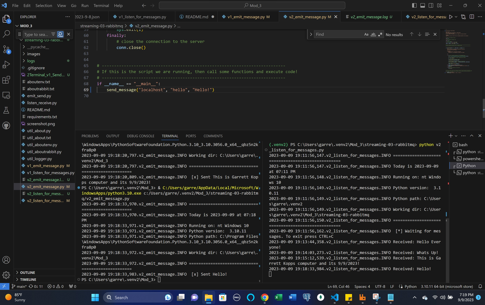

# streaming-03-rabbitmq

## Author: Garrett Kopp

## GitHub Repo: https://github.com/ggkopp/streaming-03-rabbitmq

## Prerequisites

1. Git
1. Python 3.7+ (3.11+ preferred)
1. VS Code Editor
1. VS Code Extension: Python (by Microsoft)
1. RabbitMQ Server installed and running locally

## Before You Begin

1. Fork this starter repo into your GitHub account.
1. Clone your repo down to your machine.
1. Explore your new project repo in VS Code on your local machine.

## Task 1. Create a Python Virtual Environment ### Complete

## Task 2. Activate the Virtual Environment ### Complete

## Task 3. Install Dependencies into the Virtual Environment ### Complete

## Task 4. Verify Setup ### Complete

## Task 5. Read ### Complete

## Task 6. Execute the Producer/Sender ### Complete

1. Read v1_emit_message.py (and the tutorial)
1. Run the file. 

## Task 7. Execute the Consumer/Listener ### Complete

1. Read v1_listen_for_messages.py (and the tutorial)
1. Run the file.

You'll need to fix an error in the program to get it to run.
Once it runs successfully, will it terminate on its own? It seems to have terminated on its own. How do you know? I can see there is 1 message ready in RabbitMQ and what came back was the single message that I sent when I ran the v1_emit_message.py file.  

## Task 8. Open a New Terminal / Emit More Messages ### Complete

1. Open a new terminal window.
1. Use this new window to run emit_message.py again.
1. Watch the listing terminal - what do you see?  A second message? I see a second message but its repeating the same original message and not changing to the updated message. 

1. Where is the message defined? How can you change it? Its defined where we print a message to the console for the user. 
1. Modify emit_message.py to emit a different message. 
1. Execute the updated emit_message.py. 
1. Watch what happens in the listening terminal? The listening terminal has all the udpated messages present. 

Repeat this process several times - emit at least 4 different messages.
Don't worry - it's just code. We can always revert back (try the 'undo' command in VS Code) to a version that works. You can't hurt anything.

## Multiple Terminals
V1

## Task 9. Save Time & Effort: Don't Repeat Yourself ### Complete

## Version 2

Now look at the second version of each file.
These include more graceful error handling,
and a consistent, reusable approach to building code.

Each of the version 2 programs include an error as well. 

1. Find the error and fix it. Done
1. Compare the structure of the version 2 files. Done
1. Modify the docstrings on all your files. Done
1. Include your name and the date. Done
1. Imports always go at the top, just after the file docstring. Done
1. Imports should be one per line - why? because the logger used in the code is configured to log messages in a single-line format. Specifically using a custom logger (logger) created using the util_logger module.
1. Then, define your functions.
1. Functions are reusable logic blocks.
1. Everything the function needs comes in through the arguments.
1. A function may - or may not - return a value. 
1. When we open a connection, we should close the connection. 
1. Which of the 4 files will always close() the connection?
1. Search GitHub for if __name__ == "__main__":
1. How many hits did you get? I got at least 5 hits
1. Learn and understand this common Python idiom.

## Multiple Terminals
V2

## Reference

- [RabbitMQ Tutorial - Hello, World!](https://www.rabbitmq.com/tutorials/tutorial-one-python.html)
- [Using Python environments in VS Code](https://code.visualstudio.com/docs/python/environments)
- [RabbitMQ Get Started](https://www.rabbitmq.com/#getstarted)

